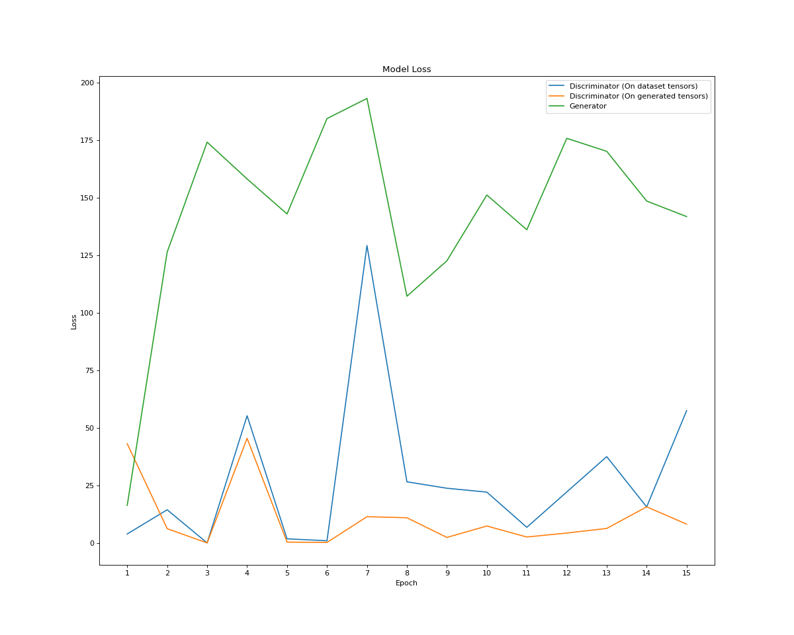
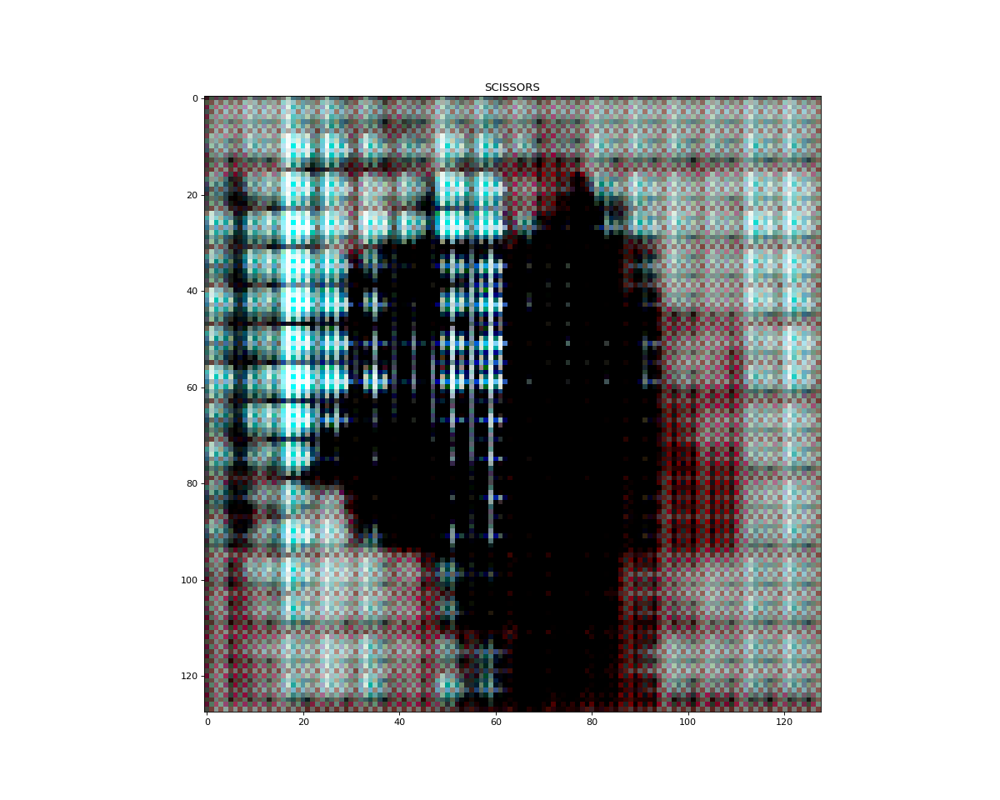
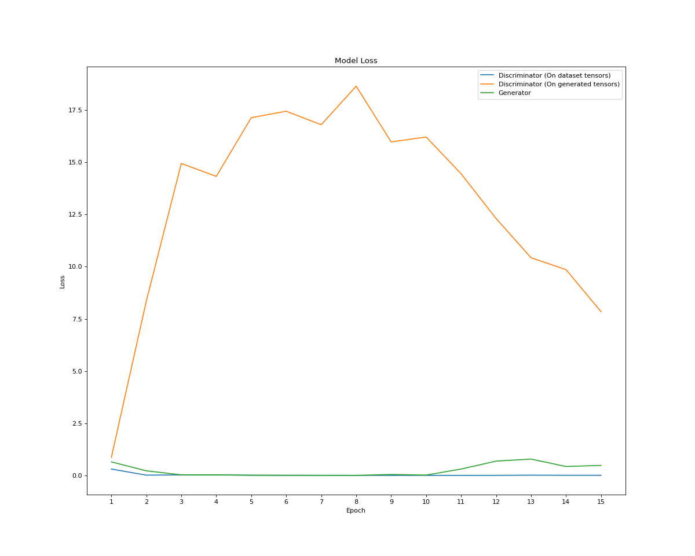
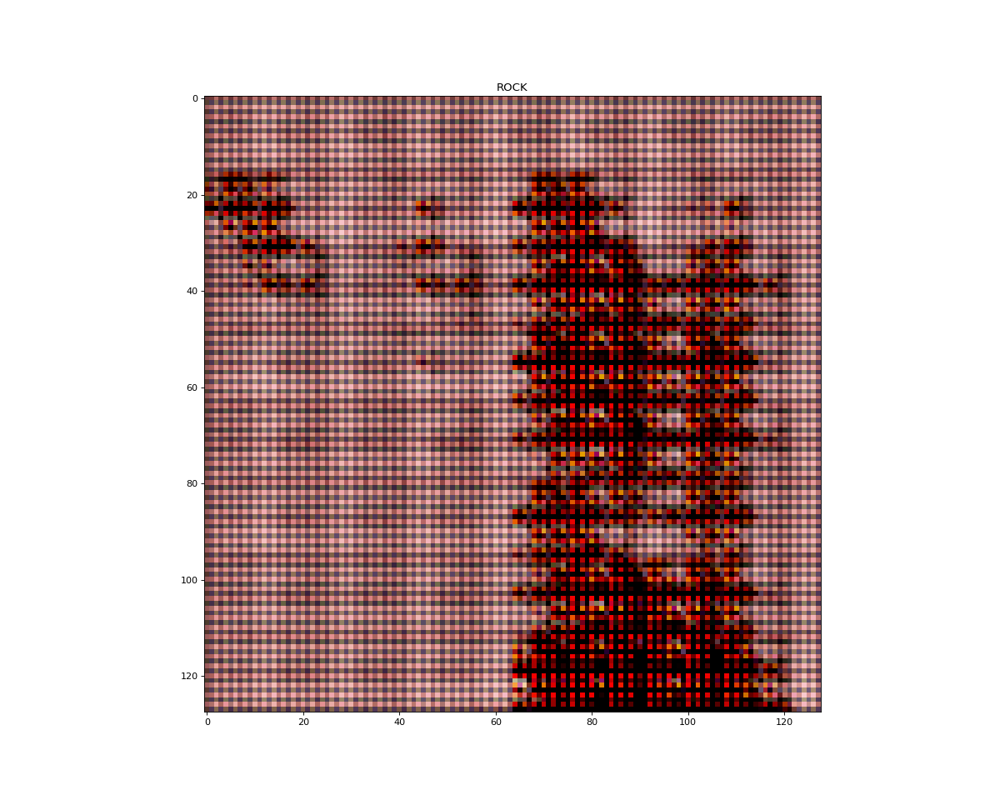

Tests ran on seed 345, on 60% train ratio and a batch size of 256.

# 15 EPOCHS

# RESULTS PER ATTEMPT WITH THE FOLLOWING PARAMETERISATIONS

| Hyperparam Test Run   |   #1      |   #2         |
| :---------            | :-:       | :-:          |
| D Embedding Size      | 5         |   5          |
| G Embedding Size      | 5         |   5          |
| D Initial Nodes       | 64        |   64         |
| G Initial Nodes       | 64        |   128        |
| Learning Rate D       | 0.01      |   0.00075    |
| Learning Rate G       | 0.001     |   0.00075    |
| D Optimiser           | Adamax    |   Adamax     | 
| G Optimiser           | Adamax    |   Adamax     |
| Add Noise             | True      |   True       |
| Optimiser Beta Min    | 0.5       |    0.5       |
| D Dropout Rate        | 0.2       |   0.2        |
| Optimiser Beta Min    | 0.5       |   0.5        |
| TRAINING TIME/EPOCH   | ~2.5min   |   ~4.8min    |
| TOTAL TRAINING TIME   | ~36.25min |   ~56.5min   |
| AVG. LOSS D           | 57.47     |   0.005016   |
| AVG. LOSS D_G         | 8.16      |   7.84       |
| AVG. LOSS G           | 141.80    |   0.47       |

# Loss Plots & Last Generated Image

## Test Run 1

## Test Run 2

