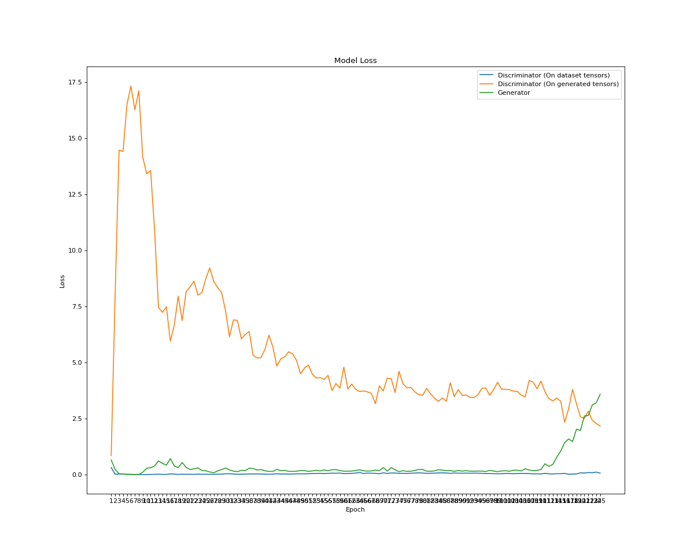
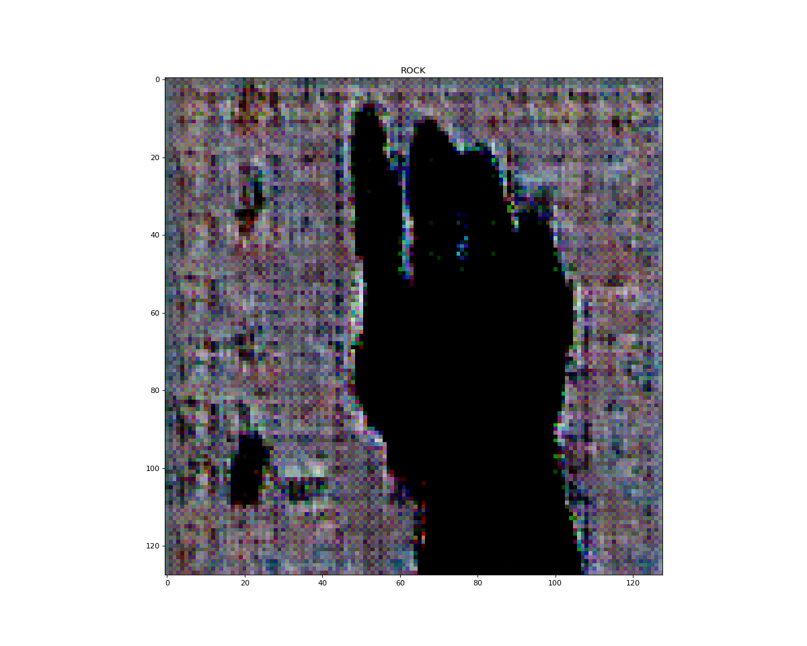

Tests ran on seed 345, on 60% train ratio and a batch size of 256.

# 125 EPOCHS

# RESULTS PER ATTEMPT WITH THE FOLLOWING PARAMETERISATIONS

| Hyperparam Test Run       |   #1      |   #2         |
| :---------                | :-:       | :-:          | 
| D Embedding Size          | 5         |   5          | 
| G Embedding Size          | 5         |   5          |  
| D Initial Nodes           | 64        |   128        |  
| G Initial Nodes           | 128       |   128        |  
| G Noise Initial Nodes     | 512       |   512        |   
| Learning Rate D           | 0.00075   |   0.00075    | 
| Learning Rate G           | 0.00075   |   0.00075    | 
| D Optimiser               | Adamax    |   Adamax     |   
| G Optimiser               | Adamax    |   Adamax     |   
| Add Noise                 | True      |   True       |   
| Optimiser Beta Min        | 0.5       |    0.5       |  
| D Dropout Rate            | 0.2       |   0.2        |   
| Optimiser Beta Min        | 0.5       |   0.5        |   
| 🔴TRAINING TIME/EPOCH🔴    | ~3.7min   |   ?          |    
| 🔴TOTAL TRAINING TIME🔴    | ~7.4hr    |   ?          |   
| 🔴AVG. LOSS D🔴            | 0.0633    |   ?          |  
| 🔴AVG. LOSS D_G🔴          | 2.16      |   ?          |   
| 🔴AVG. LOSS G🔴            | 3.57      |   ?          |   

# Loss Plots & Last Generated Image

## Test Run 1

## Test Run 2