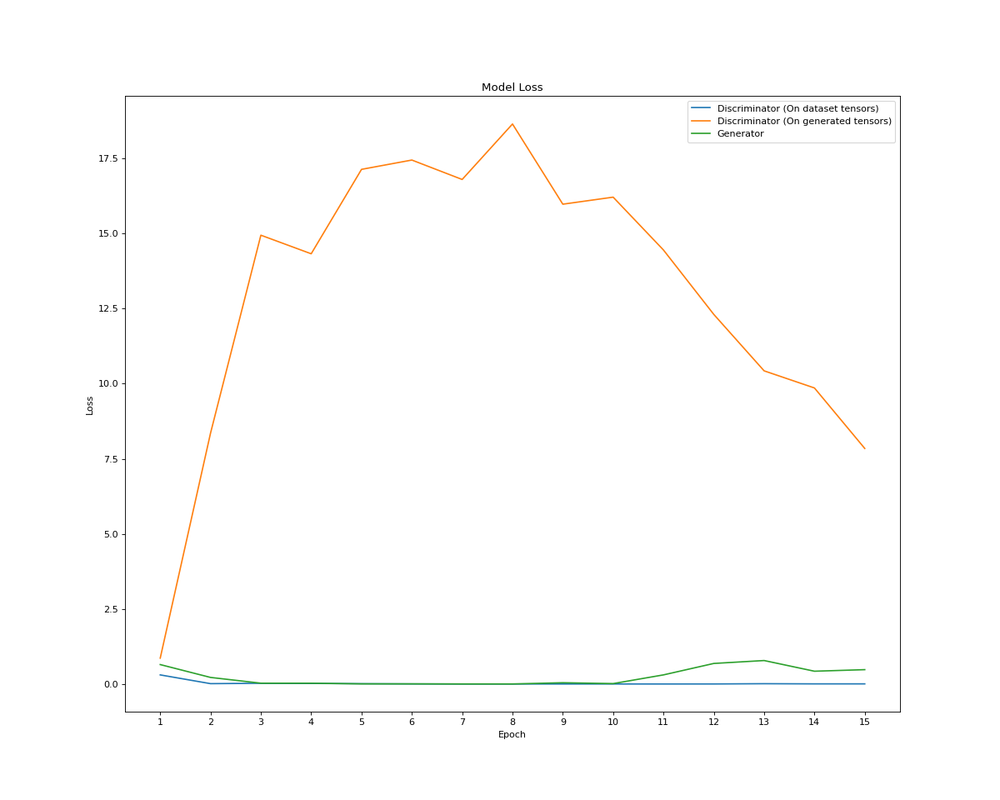

Tests ran on seed 345, on 60% train ratio and a batch size of 256.

# 15 EPOCHS

# RESULTS PER ATTEMPT WITH THE FOLLOWING PARAMETERISATIONS

| Hyperparam Test Run       |   #1      |   #2         |   #3        |
| :---------                | :-:       | :-:          |   :-:       |
| D Embedding Size          | 5         |   5          |   5         |
| G Embedding Size          | 5         |   5          |   5         |
| D Initial Nodes           | 64        |   64         |   128       |
| G Initial Nodes           | 64        |   128        |   128       |
| G Noise Initial Nodes     | 512       |   512        |   512       |
| Learning Rate D           | 0.01      |   0.00075    |   0.00075   |
| Learning Rate G           | 0.001     |   0.00075    |   0.00075   |
| D Optimiser               | Adamax    |   Adamax     |   Adamax    |
| G Optimiser               | Adamax    |   Adamax     |   Adamax    |
| Add Noise                 | True      |   True       |   True      |
| Optimiser Beta Min        | 0.5       |    0.5       |   0.5       |
| D Dropout Rate            | 0.2       |   0.2        |   0.2       |
| Optimiser Beta Min        | 0.5       |   0.5        |   0.5       |
| 🔴TRAINING TIME/EPOCH🔴    | ~2.5min   |   ~4.8min    |   ?         | 
| 🔴TOTAL TRAINING TIME🔴    | ~36.25min |   ~56.5min   |   ?         |
| 🔴AVG. LOSS D🔴            | 57.47     |   0.005016   |   ?         |
| 🔴AVG. LOSS D_G🔴          | 8.16      |   7.84       |   ?         |
| 🔴AVG. LOSS G🔴            | 141.80    |   0.47       |   ?         |

# Loss Plots & Last Generated Image

## Test Run 1

## Test Run 2

## Test Run 3

