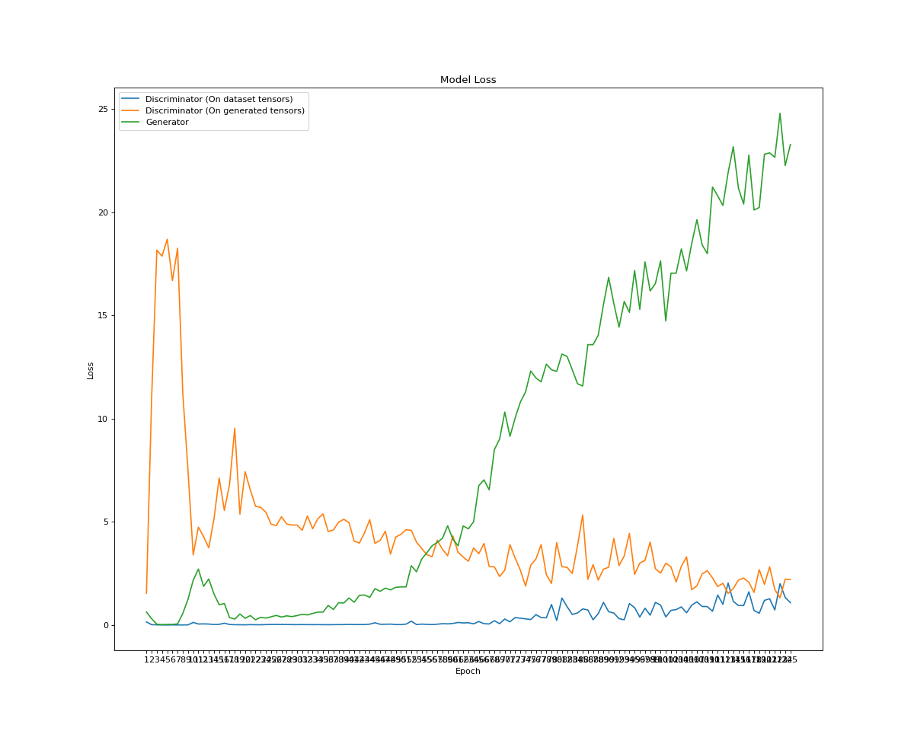
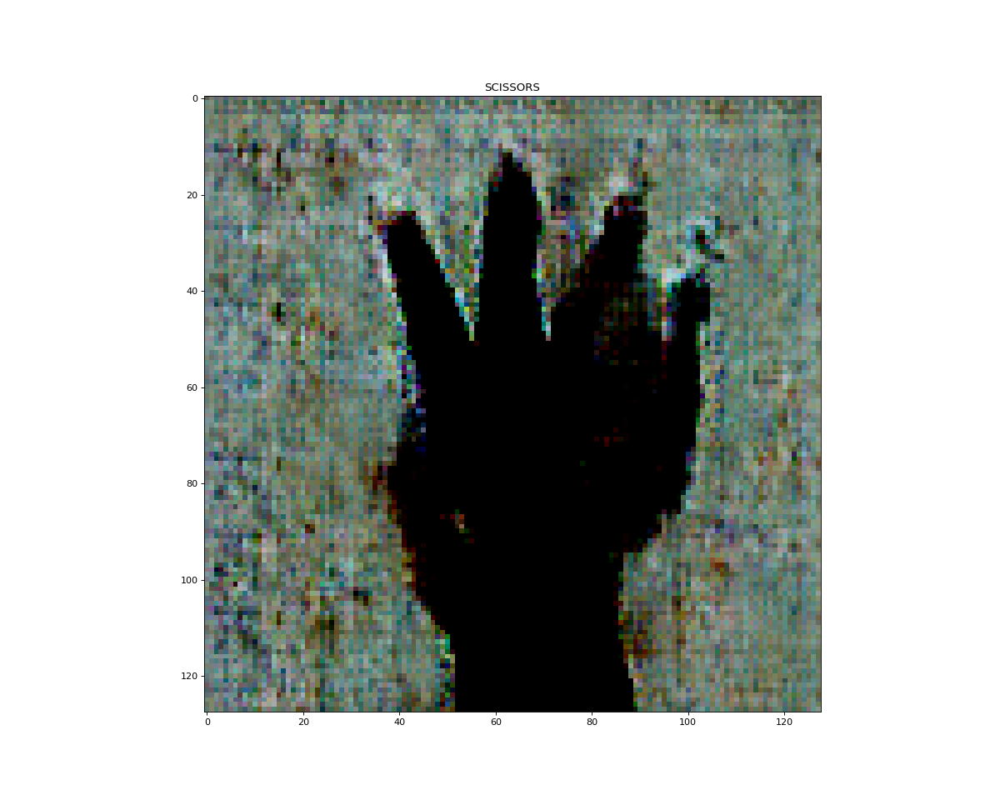

Hyperparameter configuration for the cGAN model used in production.

Test/Train Split : 70%
Epochs : 125

# MODEL RESULTS WITH THE CURRENT PRODUCTION PARAMETERISATIONS

| Hyperparam Test Run       |  Current  |  
| :---------                | :-:       | 
| D Embedding Size          | 5         |  
| G Embedding Size          | 5         |   
| D Initial Nodes           | 128       | 
| G Initial Nodes           | 128       | 
| G Noise Initial Nodes     | 512       |   
| Learning Rate D           | 0.00075   | 
| Learning Rate G           | 0.00075   | 
| D Optimiser               | Adamax    |   
| G Optimiser               | Adamax    |   
| Add Noise                 | True      |   
| Optimiser Beta Min        | 0.5       |   
| D Dropout Rate            | 0.2       |    
| Optimiser Beta Min        | 0.5       |    
| 🔴TRAINING TIME/EPOCH🔴    | ~8.3min   |    
| 🔴TOTAL TRAINING TIME🔴    | ?        |   
| 🔴AVG. LOSS D🔴            | ?    |  
| 🔴AVG. LOSS D_G🔴          | ?      |     
| 🔴AVG. LOSS G🔴            | ?      |    

# Loss Plot & Last Generated Image

